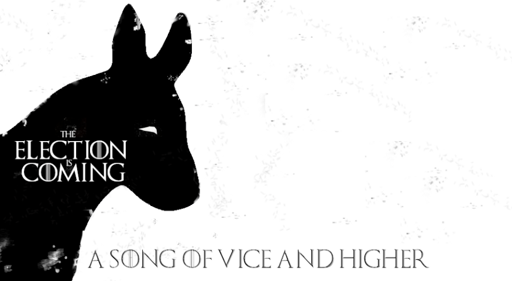
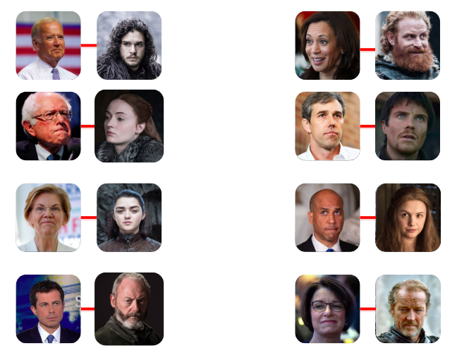
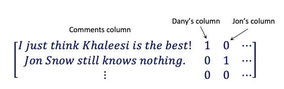
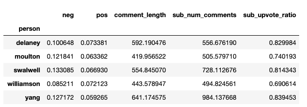
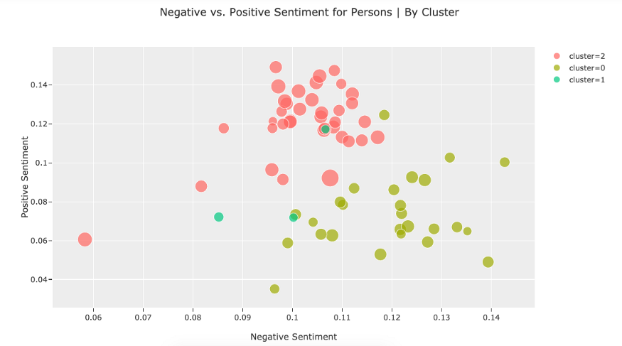
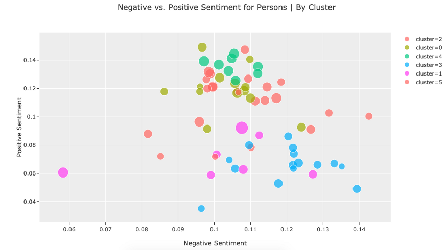
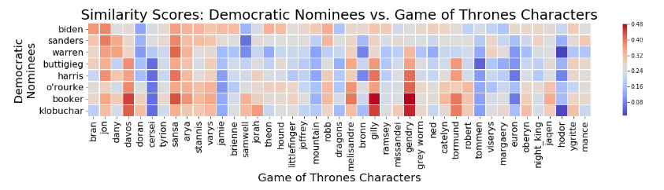
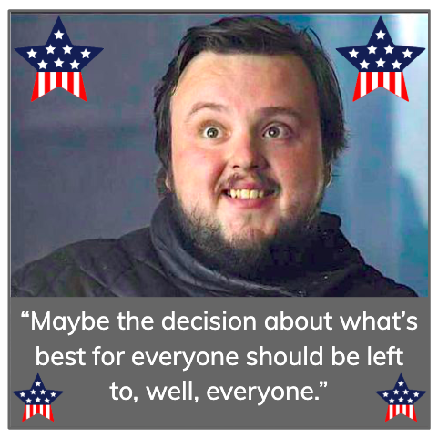

<a href="https://medium.com/@mia.iseman/a-song-of-vice-and-higher-characterizing-presidential-nominees-through-game-of-thrones-5dc685f6c1dd?source=friends_link&sk=0877ee270a9dc5f3f91314e575b9207d">View this information as a blog.</a> 

# A Song of Vice and Higher: Characterizing Presidential Nominees Through Game of Thrones
### Contributors:   
<a href="https://github.com/MangrobanGit">Werlindo Mangrobang</a>   
<a href="https://github.com/MIAISEMAN">Mia Iseman</a> 

This summer, so many people are voicing strong opinions about Game of Thrones — the dragons, the romances, and of course who deserved to rule the Seven Kingdoms. In fact, you’ve probably heard a ton of real-world political justifications for the events in this story — this story that is set in a world where dragons and magic exist. Fans love analyzing the politics of the show, and they have since the first season.

What about real politics? Hopefully everyone that has a strong opinion about Game of Thrones is equally invested in the nonfictional U.S. presidential election coming up in 2020. Just in case you’ve been a little more interested in the Battle of Winterfell than the Democratic debate schedule, we put together a Who’s Who List mapping the nominees to Game of Thrones characters — using science!

  
<i>The presidential nominees polling above 2% and their corresponding Game of Thrones characters</i>

Bernie Sanders? More like Bernie Sansa! And Gendry — the good ol’ boy from the south with a confusing namesake — that’s Beto alright! Who will be the one that eventually defeats the Night King before he can raise his zombie hordes once again? Arya Stark, a.k.a. Elizabeth Warren!

If this feels a little click-baity so far, you’re not wrong. The rest of this essay chronicles in detail the process for creating our list. Read on for the science behind these pairings, and feel free to explore our Github repository further.

## Acquiring and Preparing the Data
We used Reddit comments and Natural Language Processing to create our mappings. Through the Reddit API, and a little help from <a href="https://towardsdatascience.com/exploring-reddits-ask-me-anything-using-the-praw-api-wrapper-129cf64c5d65">this article</a>, we saved over 300,000 comments from the Politics and Game of Thrones subreddits to a PostgreSQL database on AWS Relational Database Services.

Once we had a long list of comments, we needed to attribute the comments to specific people. (For our purposes, “people” refers to both fictional characters and nonfictional nominees.) To do that, we created a function that examined each row of the dataframe of comments, compared each comment to a dictionary of people and their pseudonyms, and tallied whether the name appeared in the comment to give that person credit. This turned out to be incredibly time-consuming, so we found a better way: matrices!

Using sklearn’s CountVectorizer, we turned the 324,629 comments and 114 pseudonyms into a matrix. We also created a 114 by 67 matrix for the 114 pseudonyms (e.g. Khaleesi and Dany are the same person) and the 67 people. Then we took the dot product of those two matrices to get the comments attributed to each of our people by a number in that comment’s row:

   
<i>An example of the dot product’s resulting matrix</i> 

## Clustering using Sentiment and Volume as Features
Since we were most interested in doing analysis per character, we created a matrix that had people as the first column and their features as the other columns. We used Vader to analyze the sentiment of each comment and used the positive score as the first feature and then the negative score as another. We also used the the Reddit “upvote ratio” (upvotes divided by downvotes), the number of comments, and the comment length as features. The sub_num_comments column was also eventually used to find the average of the features based on all the comments.

If we used unsupervised kmeans clustering to see what the various groups were, what would we find? The optimal k (3) didn’t amount to much more than the nominees being grouped together with other nominees, and same for the characters. We did notice, interestingly, that the sentiment towards characters was generally interpreted more positively than the nominees.

## Adding Semantic Features
In a search for more compelling clusters, we wanted features that were different from user sentiment and volume. What if we looked at how the character names were associated with each other? For this, we used Gensim, a tool that allows you to “analyze plain-text documents for semantic structure” and “retrieve semantically similar documents.” That’s just what we did!

We used all the comments as the corpus for training a word2vec model, which turns the words into vectors. We then compared the people to the words “presidential,” “throne,” and “leader” using Gensim’s "most similar" feature which utilizes cosine similarity. We had slightly more interesting results when we re-clustered (k=6) using these features, but it still wasn’t giving us a natural overlap in the two different domains. 

## Matching with Similarity Scores

It was clear that we needed to be more ham-fisted to achieve our click-baity goal of matching Game of Thrones characters with presidential nominees. So, we threw sentiment and volume to the wind and only worked with the similarity scores from "most similar." To simplify our analysis, we decide to focus only on the top 8 nominees, those who were polling above 2% at the time: Biden, Sanders, Warren, Buttigieg, Harris, O’Rourke, Booker and Klobuchar.  

To create our final rankings, we looked at the nominees in the order of polls and paired them with their highest matched character.

 

There you have it! Of course, since this is a playful study based on unsupervised learning, there is no sure-fire way to evaluate our findings, though perhaps we can evaluate more on November 4th, 2020.  So, don’t forget to vote or you’re no better than the Game of Thrones lot.

  

